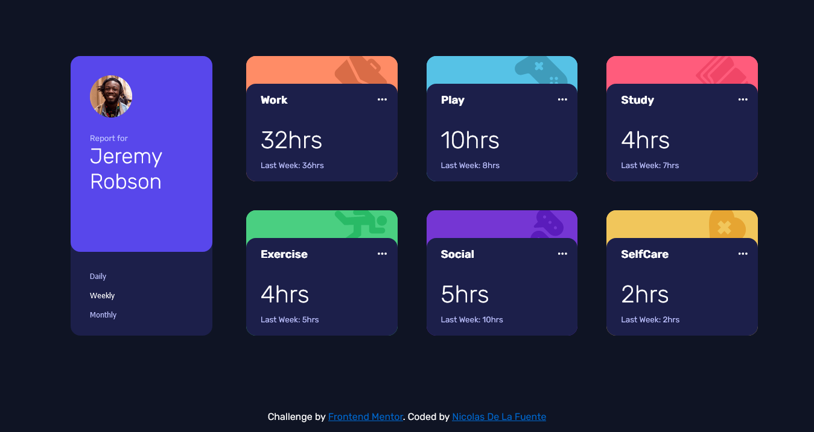

# Frontend Mentor - Time tracking dashboard solution

This is a solution to the [Time tracking dashboard challenge on Frontend Mentor](https://www.frontendmentor.io/challenges/time-tracking-dashboard-UIQ7167Jw). Frontend Mentor challenges help you improve your coding skills by building realistic projects. 

## Table of contents

- [Overview](#overview)
  - [The challenge](#the-challenge)
  - [Screenshot](#screenshot)
  - [Links](#links)
- [My process](#my-process)
  - [Built with](#built-with)
  - [What I learned](#what-i-learned)
  - [Continued development](#continued-development)
- [Author](#author)

## Overview

### The challenge

Users should be able to:

- View the optimal layout for the site depending on their device's screen size
- See hover states for all interactive elements on the page
- Switch between viewing Daily, Weekly, and Monthly stats

### Screenshot



### Links

- Live Site URL: https://nicodelafuente.github.io/time-tracking-dashboard-frontendmentor/

## My process

### Built with

- Semantic HTML5 markup
- CSS custom properties
- Flexbox
- CSS Grid
- [Vanilla JavaScript] - native JS

### What I learned

While doing this project I was able to reinforce concepts of semantic HTML 5 markup and advance CSS stylish. Also, it was incredibly challeging for me to make this dinamic project using Vanilla JavaScript. The more projects I make with JS, the more confortable I feel with the language. I am in my path to become a JS Full Stack Developer. 
I am particularly proud of: 

- using fetch in JS to recover the data in a JSON file. 
```JS
fetch ("./data.json") 
    .then (response => response.json())
    .then((data) => {
        arrayData = data;
        console.log(arrayData);
        loadDataWeekly()
        bnts ()
    })
```

- using these styles to make the small cards. 
```css
.proud-of-this-css {
  background-color: hsl(15, 100%, 70%);
    background-image: url(../images/icon-work.svg);
    background-position: right;
    background-size:35%;
    background-repeat: no-repeat;
    background-position-x: 90%;
    background-position-y: 15%;
    image-orientation: 25deg;
    border-radius: 1rem;
    height: 3rem;
    display:flex;
    justify-content: flex-end;
}
```

### Continued development

In future projects I would like to include Sass and React (I am currently learning the last one). Also, I want to keep practising Vanilla JS to fully understand it and get confortable with all the key concepts of this beautifull lenguage. 
In addition, I consider that CSS is a key tool in any project so I aim to keep improving on this field doing my best to copy the styles I would received such I did in this project. 
My final goal is to become a Full Stack Developer. The path is long but I will do all my best to achieve it. 

## Author

- GitHub - [Nicolas De La Fuente](https://github.com/NicoDeLaFuente))
- Frontend Mentor - [@NicoDeLaFuente](https://www.frontendmentor.io/profile/NicoDeLaFuente)

